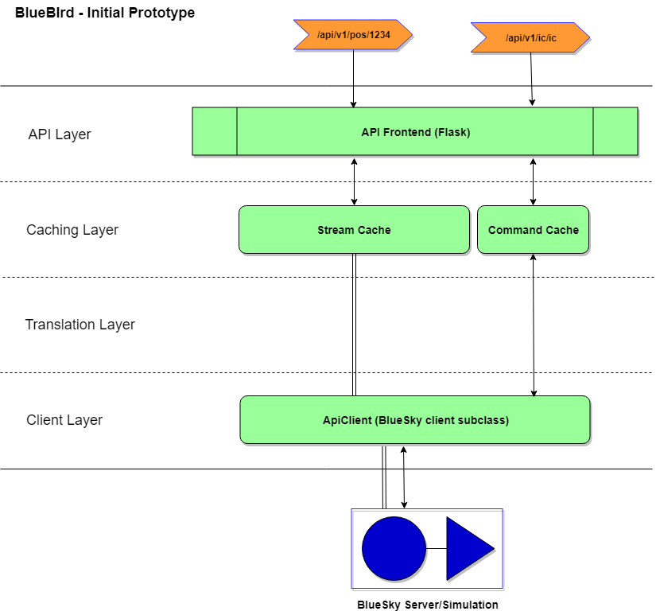

## Module layout

```
bluebird
  - api				# Flask server & API definitions
    - resources		# API Resource endpoints. One file per function.
    - static		# Static routes. Currently serves README.md only
  - cache 			# Cache objects used to store sim info from the stream
  - client			# BlueSky client class
  - utils 			# Utility functions
  __init__.py		# Main initialisation for the app
  settings.py		# Common app settings
run.py				# Entry point
```

## Notes

- When you send a command to BlueSky, you do not receive a response. This makes it difficult to wrap it into a REST service. Currently we make use of BlueSky's stream feature to continually receive the sim state. Thus when a client sends the `POS` command for example, we check the `StreamCache` for the data, rather than actually interacting with BlueSky directly.